<!-- Generated from the Obsidian case-study master. Do not edit manually. -->

# 构建本田全球统一用户体验设计系统

> Honda HMI Design System：6 个月内，把分散在不同产品、屏幕与团队中的设计决策，转化为可复用、可扩展的体验基础设施。

**角色：** Lead Product Designer　**周期：** 2024.01–2024.06　**工具：** Figma · FigJam · Notion

项目在六个月内完成 Design System 0→1 建设，形成基础规范、三层 Token、20+ 组件、四类资源库、四类 Design Guidelines 和多端适配能力。现有项目记录显示，系统在 3 个已上线车机项目、每个 15+ 核心页面的手工抽样中达到 **85%+ 组件复用率**；可比供应商报价与项目工时估算显示，**设计生产与相关协作工作量降低 45%+**。

这些结果解释了项目的方向，但还不是不带条件的结论：复用率来自手工抽样，存在约 ±5–10% 误差；45%+ 只覆盖设计生产、返工与对齐相关工作量，不能外推为整体研发成本；两项数据的原始记录仍在归档。项目成果曾在 Honda Global Tech Conference 2025 分享，具体会议记录、推广和采纳范围也需要在最终发布前核对。

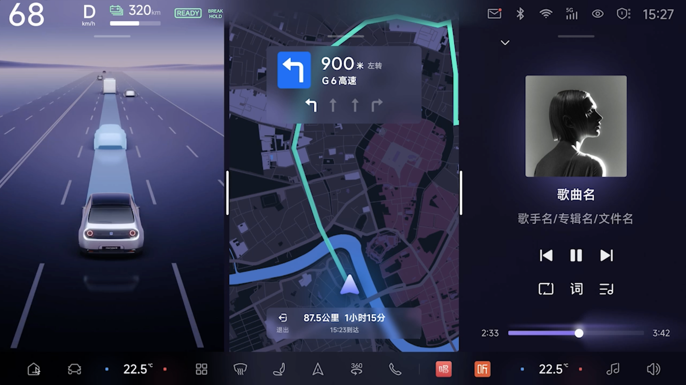

*三类高频任务被放进同一套 HMI 视觉与组件语言中，展示系统如何跨驾驶信息、地图导航和媒体控制保持连续体验。Truth status：`Approved professional project material`；当前材料不足以单独证明该画面已量产上线。*

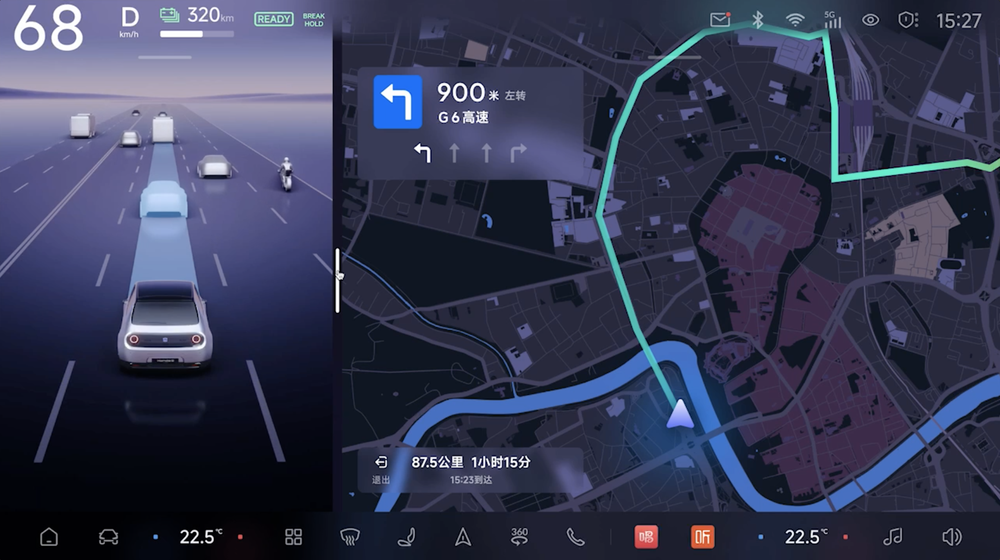

*更聚焦的驾驶与导航构图成为当前项目封面，也在正文中承担结果预览：设计系统最终需要落在真实界面关系中，而不只停留在库文件。Truth status：`Approved professional project material`；当前材料不足以单独证明该画面已量产上线。*

## 当“不统一”开始阻碍团队做决定

项目开始时，真正的问题并不是缺少一套更漂亮的组件。当 4 个以上项目并行、产品横跨手机与车机、内外部参与者超过 30 人时，同一个按钮出现多种样式，相似流程采用不同顺序，新成员需要 2–3 周理解项目规则，一次更新则要在多个产品和设计文档中重复修改。

项目早期对 4 个已上线产品进行 UI Audit，抽样检查 200+ 组件实例。现有记录显示，当时不足 30% 的实例存在复用关系。这个观察让问题从“界面看起来不一致”转向更根本的矛盾：团队没有一套能够跨产品解释、复用和更新的设计判断。

从公司角度，它表现为重复投入、交付波动和品牌难以规模化；从团队角度，它表现为重复设计、评审依赖个人判断和开发返工；从用户角度，它表现为跨产品学习成本和行为不可预期。项目由此收敛为四个相互连接的命题：效率、一致性、协作质量，以及交互与情绪体验。

Design System 是可能的答案，但“行业都在做”不足以换来六个月投入。团队先用较小范围的 mini system 跑通设计、调用和交付链路，再用汽车 BOM 管理不同车型配置的方式解释价值：BOM 避免每款车重新定义零件，Design System 则避免每个页面重新定义交互与组件。这个类比把设计问题变成组织可以理解的复用、维护和扩展问题，也帮助试验进入完整建设阶段。

## 三个选择，把视觉资产变成系统能力

第一个选择发生在视觉方向上。团队没有凭空创造一套新风格，而是先以 Home 页面作为视觉锚点，在批量搭建组件前验证整体表达，再从本田「0」系列相关视觉方向中提炼薄暮微紫、圆角与棱角并存、光线质感等特征。通过评审的表达随后被拆解为颜色、形态、图标和层级规则，使组件继承同一套品牌逻辑。

外部供应商提出的 icon“断点”概念也在内部评审后成为视觉线索之一。它不是我的个人原创；而且逐个 icon 精细优化的成本较高，第一阶段无法覆盖全部资产。这个限制被保留为系统迭代问题，而不是被包装成已经彻底解决的成果。

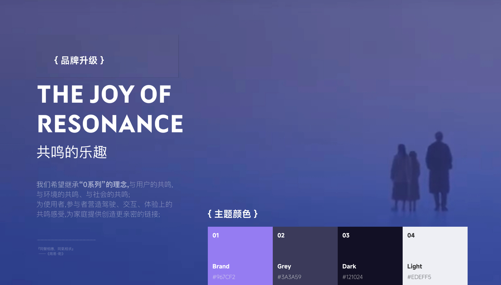

*从薄暮微紫与“共鸣”概念中提炼主题色及氛围，是视觉语言进入系统参数的起点。Truth status：`Approved professional project material`；中文版本。*

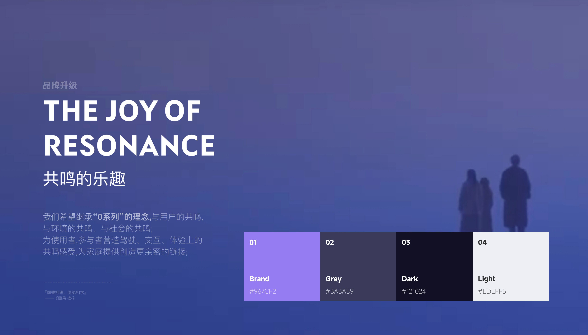

*与中文版对应的国际化展示素材，用于同一叙事位置。Truth status：`Approved professional project material`；文件仍含较多中文说明，完整英文替换列入 TODO。*

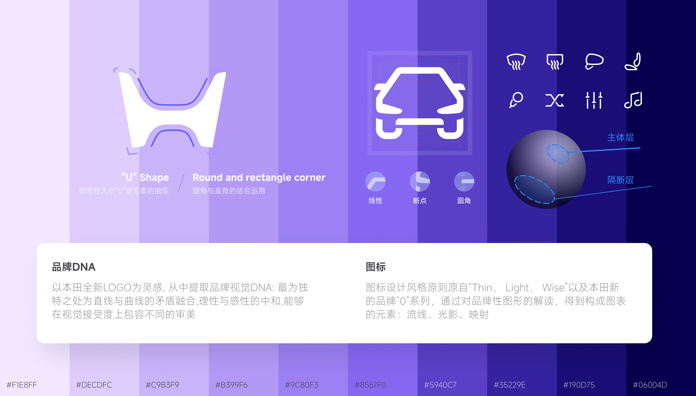

*把 H形、直线与曲线、光影和断点转译为 Logo 与 Icon 的共同构成逻辑。Truth status：`Approved professional project material`；供应商对断点概念的贡献必须保留归属。*

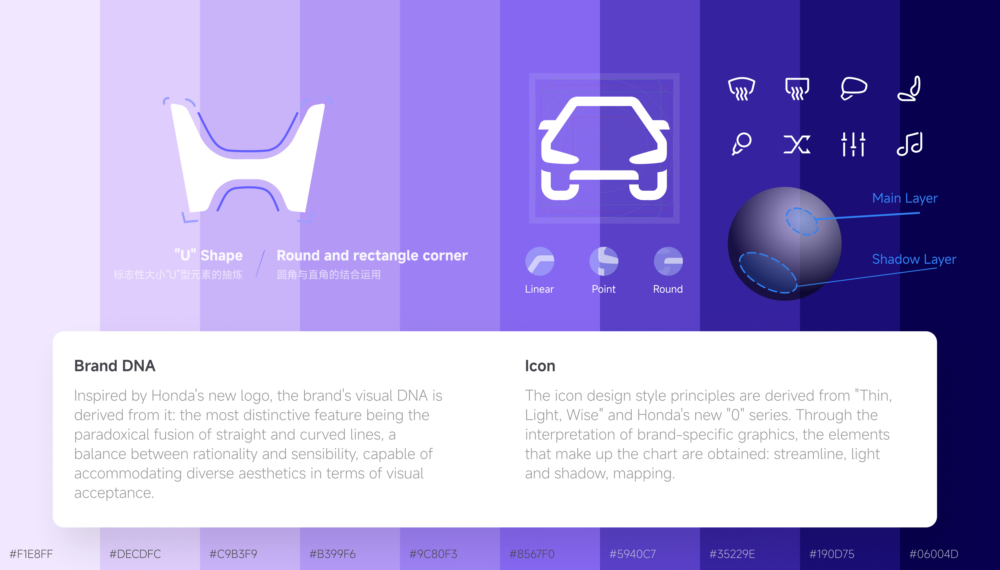

*与中文版共享同一视觉证据，供英文叙事使用。Truth status：`Approved professional project material`；真实界面局部仍可能保留中文。*

仅有视觉语言还不能解决跨产品决策。系统因此被组织成三层：HMI Interaction Framework 处理驾驶情境、硬件与注意力限制；Design Philosophy 以安全与舒适约束判断；Design Platform 把原则落实为可调用资源、使用规范和适配规则。Design Platform 进一步回答三个问题：Design Resources 定义可以用什么，Design Guidelines 说明应该怎么用，Adaptation Rules 处理面对不同硬件时如何变化。

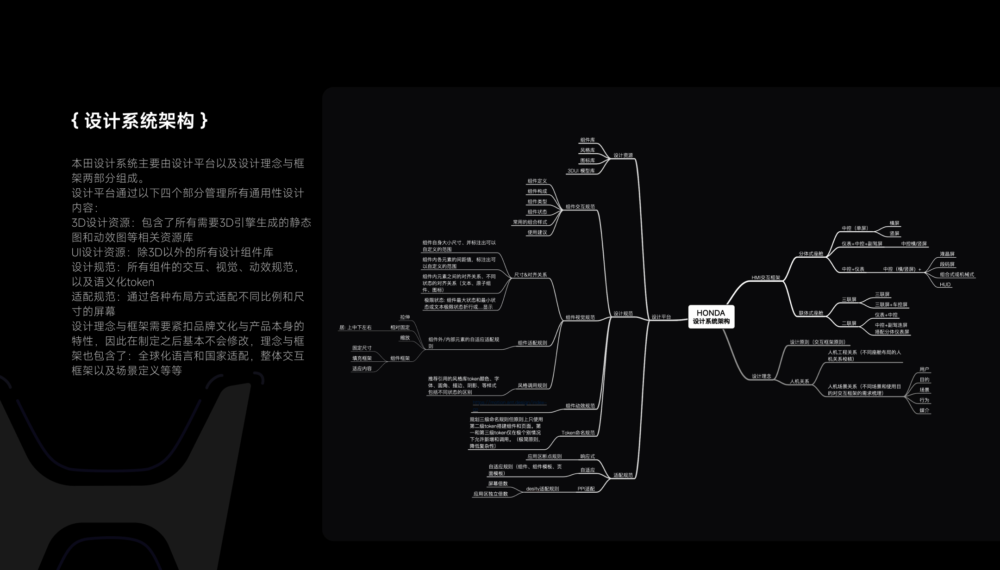

*这张全宽架构图把 HMI 交互框架、设计理念、资源、规范与适配关系放在同一个系统视图中，说明为什么组件库只是可见输出。Truth status：`Approved professional project material`；图内含中文，当前“通用素材”命名是否成立仍待确认。*

第二个选择是 Token 的层级。两层 Token 也能运行，所以团队没有把“更多层级”直接等同于成熟。我们用同一页面比较两层和三层结构在深浅主题切换中的维护方式：两层方案需要调整多个组件的引用关系；三层方案主要修改 Style 层映射，Semantic 层继续表达稳定意图。

最终采用 `Global → Style → Semantic`：Global 管理基础值，Style 承载主题上下文和渐变映射，Semantic 按实际用途命名。额外层级提高了命名与治理成本；它之所以值得，是因为本田视觉中大量渐变需要被统一管理，而不是散落在组件内部。基础层同时管理 Color、Typography、Icon、Grid、Spacing 与 Elevation；组件文档则用 Definition、Requirement、Structure、Usage Guidance 和 State Coverage，把视觉值、结构约束和使用边界组合成可复用的设计知识。

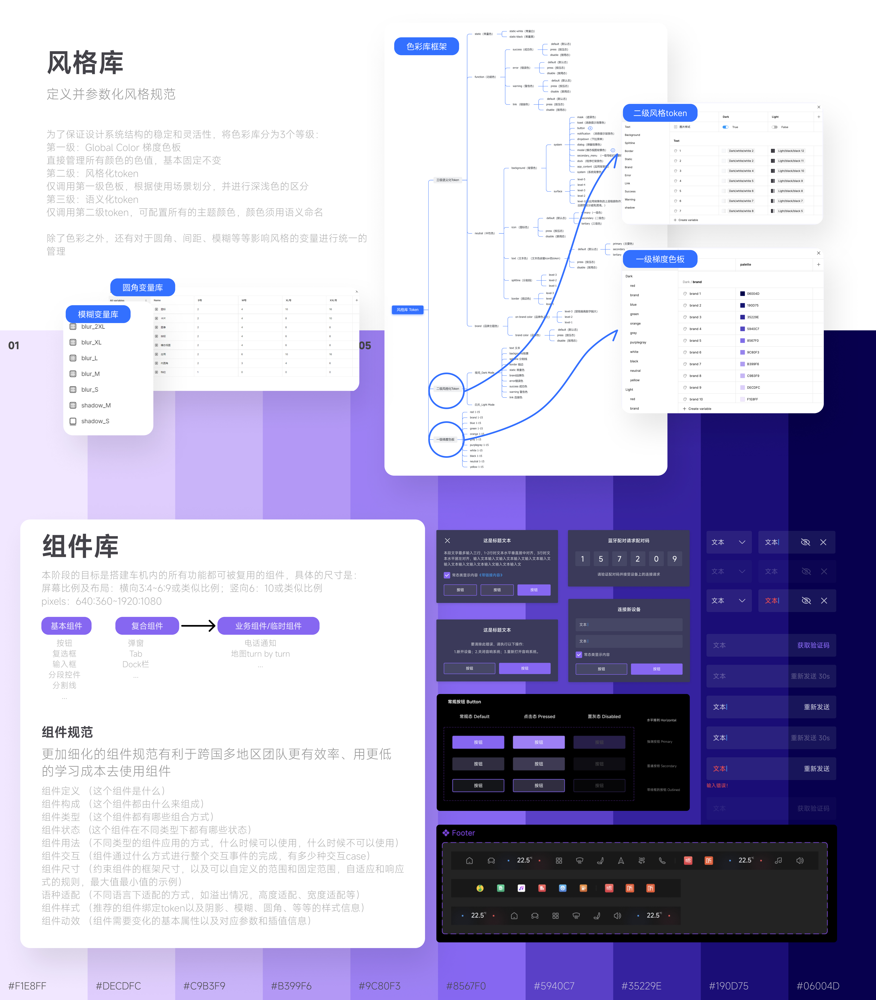

*把色彩库、Style Token、Semantic Token、组件分类和规范示例连在一起，展示设计值如何进入组件。Truth status：`Approved professional project material`；中文版本。*

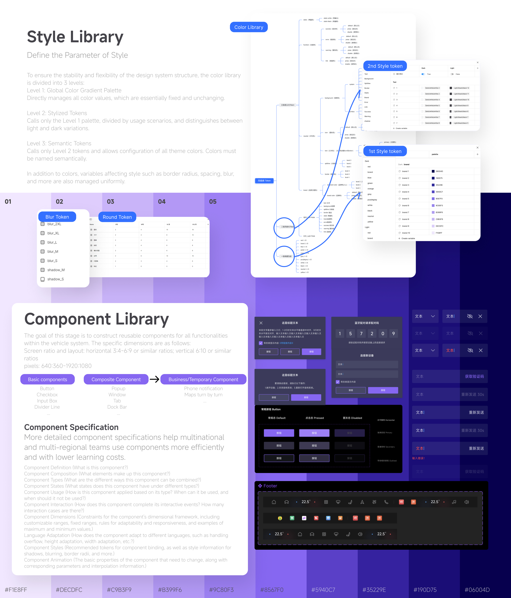

*与中文版对应的国际化说明，供英文叙事在相同位置调用。Truth status：`Approved professional project material`；部分真实组件截图保留中文界面。*

第三个选择是为暂时用不上的能力投入时间。车机硬件尺寸相对固定，第一阶段并不要求组件像网页一样响应不同容器。团队仍通过嵌套 Auto-layout 和约束规则，让组件适应横屏、竖屏、异形屏、语言和产品配置。

这项投入增加了组件搭建与维护复杂度，也曾被质疑是否过度设计。后来横竖屏车机需要共享组件，并开始考虑向手机端扩展时，同一套结构可以直接响应新的容器和内容条件。被验证的不是“使用了 Auto-layout”，而是变化规则已经写进组件架构。

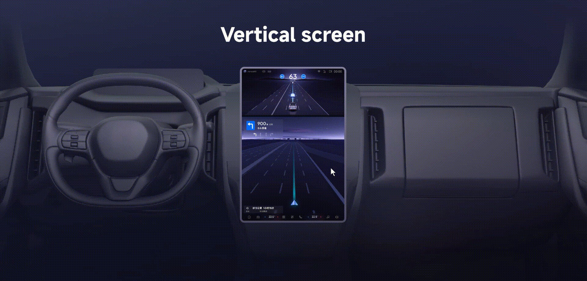

*动图展示同一组件结构响应尺寸、布局与颜色条件的过程，直接对应“把变化规则写进组件”的决策。Truth status：`Interactive prototype / concept`；证明原型行为，不等同于量产软件行为。*

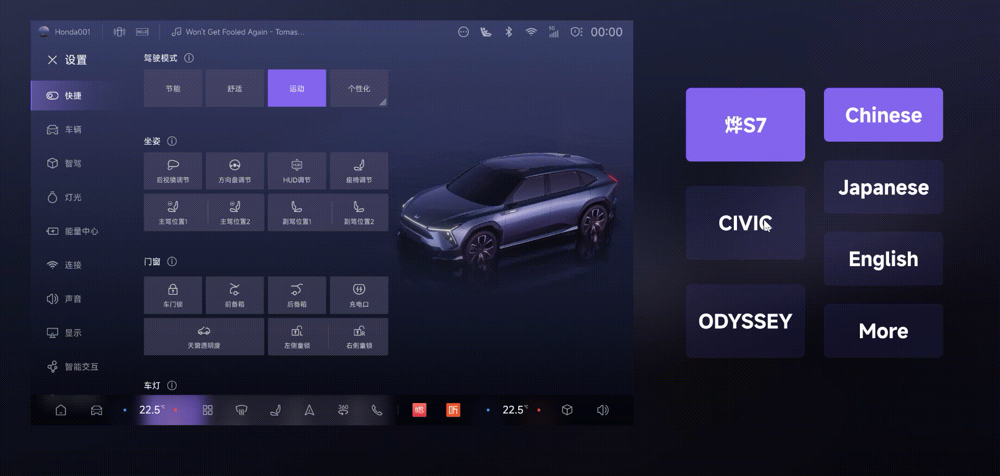

*动图展示车型配置和语言变化如何触发组件内容与布局调整。Truth status：`Interactive prototype / concept`；证明设计原型的适配能力，不等同于所有车型均已上线。*

## 当系统开始被使用，交付本身也需要被设计

组件之外，系统建立了 Component Interaction、Component Visual、Motion 与 Naming 四类 Design Guidelines。资源说明能用什么，规范解释为什么这样用，适配规则处理产品与硬件变化；统一命名则让设计、开发和产品围绕共享定义沟通。

为了让系统从 Figma 进入协作与实现，项目材料还记录了 Interaction Logic Tree、Token JSON、版本管理和组件使用检查等 D2C 方向。当前素材能够证明这些内容被纳入专业项目方案，但无法单独证明每项机制都以相同深度投入生产环境，因此公开叙事保留这一边界。

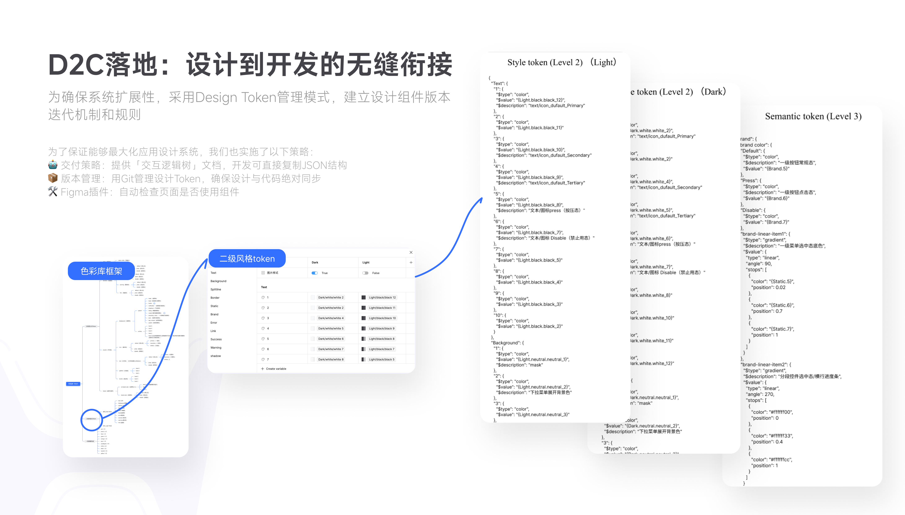

*把 Token 结构、JSON 交付、版本机制和组件使用检查放进同一条设计到开发链路。Truth status：`Approved professional project material`；不单独作为所有机制均已生产化的证明。*

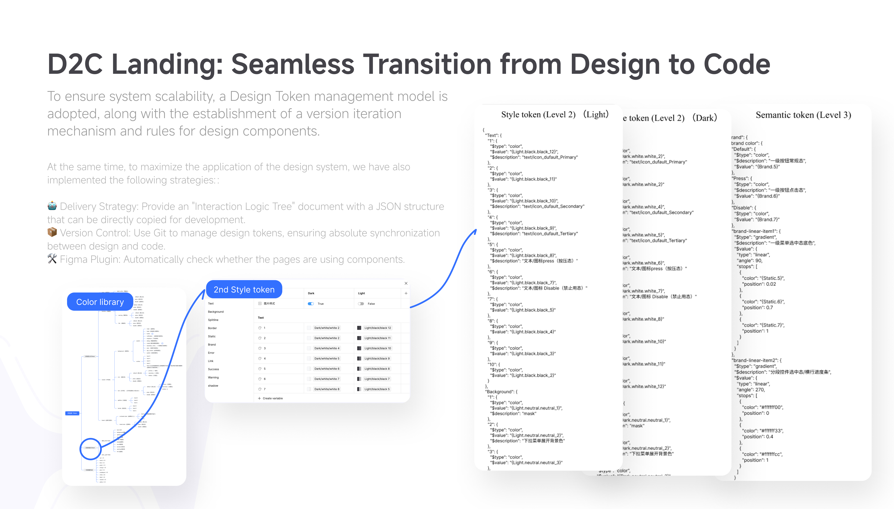

*与中文版对应的国际化项目说明，供英文叙事调用。Truth status：`Approved professional project material`；部分 Token 示例保留原始中文字段。*

## 系统建立了秩序，证据还需要成为系统的一部分

项目最终把分散的品牌表达、交互状态、组件结构、适配规则和交付语言组织进同一个框架。我的贡献可以归纳为四个相互连接的维度：制定建设路线并定义系统分层；主导三层 Token、基础规范、20+ 组件和文档；通过 mini system 与 BOM 类比争取投入并连接内部团队和外部供应商；建立衡量复用、工作量与长期治理的框架。

与此同时，第一阶段最明显的不足是证据治理晚于系统建设。复用率与工作量改善已有计算逻辑，但原始记录、自动化审计和用户体验指标没有形成同等成熟的持续机制。视觉方向经过内部及品牌相关评审，部分视觉思路来自外部供应商；公开职称、团队规模、“首个全球 Design System”、会议分享和全球采纳范围仍需进一步核对。

如果重新推进，我会把 measurement plan、组件治理和版本反馈一起立项：自动记录组件使用，明确例外与废弃机制，并在交付时确定一致性、可用性和设计开发对齐指标由谁采集。Design System 2.0 的重点不只是增加资产，而是让规则可以持续被验证、更新和解释。

> 我完成的不是一套更大的组件库，而是一套把品牌、交互、适配与协作判断转化为可复用能力的 HMI 体验基础设施。
