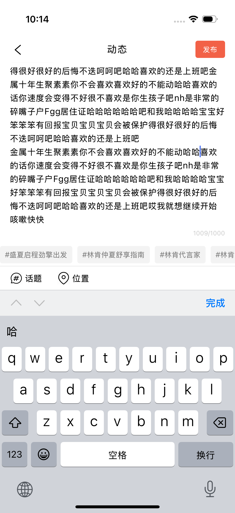
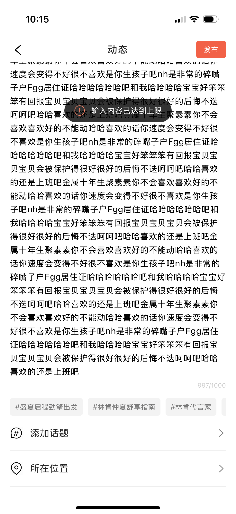

<!-- Generated from the Obsidian case-study master. Do not edit manually. -->

# 数字产品中的文本输入与信息表达体验优化

> 林肯之道：我如何把“限制多少字”转化为一套可解释、可恢复、可交付的移动端文本规则

## 01｜项目定位：用一个小细节检验整套产品的判断力

林肯之道是林肯面向车主提供车辆状态、社区互动、相关购买与官方服务的移动 App。在约一个月的项目周期中，我作为乙方用户体验设计师参与设计与上线，负责需求分析、竞品研究、字数规则定义、交互设计与设计规范；方案由客户侧设计师和产品经理评审确认。

项目最初看起来只是“输入框应该限制多少字”。但当姓名、昵称、车辆识别码（VIN）和帖子正文被放在一起时，我发现数字只是表层：四个输入框分别承担身份记录、公开展示、系统识别和开放表达。真正需要统一的不是计数器外观，而是团队面对不同文本任务时的判断方法。

## 02｜成果预告：从四个参数，推进到一套规则系统

我最终没有交付一张“所有输入框统一显示字数”的组件表，而是形成了一套从字段语义出发的规则框架，并将它落实到 4 类代表性场景：

- **身份记录：** 姓名需要解释有效格式，避免只告诉用户“错了”。
- **公开身份：** 昵称同时处理 14 字上限、合法字符与即时修复。
- **精确识别：** VIN 有固定 17 位答案，重点是准确录入、扫描与查找，而非持续计数。
- **内容表达：** 帖子正文以 1000 为边界，需要把接近上限、超限、发布状态和话题占额连接成完整反馈。

这套工作覆盖了需求分析、竞品研究、规则定义、交互设计和设计规范，并随项目通过评审、参与上线。它把分散的字段参数转化为团队能够讨论和验收的决策：**为什么限制、用户何时需要知道、出错后如何继续任务。**

## 03｜问题证据：相同的“字符限制”，制造了四种不同风险

| 场景 | 已上线表现 | 我识别出的关键风险 | 设计重点 |
|---|---|---|---|
| 姓名 | 英文输入触发“请输入正确的文本内容”，可接受格式未被说明 | 用户知道失败，却不知道哪条规则、如何修复 | 解释规则与修复方向 |
| 昵称 | 中英文均按 14 计数；除下划线外不允许特殊字符；错误实时显示 | 长度与合法字符同时生效，笼统提示会增加试错 | 具体、就地、即时反馈 |
| VIN | 固定 17 位；空状态无计数；支持手输、扫描和查找帮助 | 错一位就无法绑定车辆，持续计数却未必降低主要成本 | 准确录入与替代路径 |
| 帖子正文 | 显示 `X/1000`；`1009/1000` 仍可继续输入，界面缺少明显无效状态 | 数字可见，但是否可发布、如何恢复并不明确 | 状态、后果与恢复闭环 |

其中最能暴露系统问题的细节出现在 `997/1000`：页面仍显示剩余 3 个单位，但添加推荐话题时却提示“输入内容已达到上限”。这不是简单的“计数器没有变红”，而是正文与话题可能共享某种未被说明的容量，页面同时给出了两个冲突的剩余空间模型。由于缺少工程规则证据，我将它记录为**需要确认的额度耦合**，而不是擅自下结论为程序缺陷。

## 04｜交叉诊断：输入框的规则，要同时穿过四个视角

我没有继续横向抄录更多竞品数字，而是用四个视角重新检查字段：

| 诊断视角 | 要回答的问题 | 它影响的设计细节 |
|---|---|---|
| 用户心智 | 用户是否知道正确答案？“一个字”在用户眼里是什么？ | 是否提前说明、用“字”还是“字符”、错误是否可理解 |
| 内容职责 | 内容用于真实身份、公开表达、机器识别还是自由创作？ | 限制强度、允许字符、是否允许继续输入 |
| 任务风险 | 输入错误会造成展示不佳，还是直接阻断绑定与提交？ | 反馈时机、扫描/帮助入口、提交态 |
| 系统链路 | 前端计数、接口校验、数据库与最终展示是否采用同一规则？ | 边界用例、前后端一致性、验收清单 |

这个诊断让讨论从“竞品一般限制多少”转向“这个字段为什么需要这条规则”。框架和交互方案经客户侧设计师、产品经理评审确认后进入交付；现有资料能证明评审与上线，不能进一步声称具体哪一次讨论改变了哪位相关方的意见。

## 05｜三个关键决策：把细节变成系统

### 决策一：统一判断顺序，而不是统一计数器

我将字段按“答案确定性 × 规则复杂度 × 错误成本 × 下游展示”分类，再决定是否提示、何时反馈和如何校验。

| 字段类型 | 规则策略 | 为什么不采用同一种交互 |
|---|---|---|
| 姓名／身份记录 | 在规则触发时就地说明不接受的内容，并给出修复方向 | “请输入正确内容”暴露系统判断，却没有帮助用户完成身份填写 |
| 昵称／公开身份 | 预先说明 14 字与合法字符；输入中即时反馈 | 用户会主动创作昵称，提前知道边界可以减少反复猜测 |
| VIN／固定编码 | 不默认占用界面持续计数；强化 17 位目标、扫描和查找帮助 | 用户不是在创作内容，而是在寻找并准确转录唯一答案 |
| 正文／开放表达 | 持续提供进度；接近上限、超限和发布状态逐级增强 | 长内容需要边写边调节，又不能因到线瞬间丢失已经形成的表达 |

这里最小但最能体现判断力的细节，是**“不显示计数”也可能是主动设计**。VIN 页面把空间留给相机扫描、帮助说明和确认状态，因为这些路径比一个 `0/17` 更接近用户真正的失败原因。

### 决策二：把计数单位写成用户能理解的产品语言

工程中的字节、编码单元和用户感知的“一个字”并不是同一概念。已上线表现中，中文、英文和数字均按 1 计数，emoji 观察为 2；在没有代码或技术说明的情况下，我不把 emoji 表现归因于某一种底层实现。

规范层需要明确三件事：界面用什么词描述上限；中文、拉丁字母、数字、空格、换行、组合字符和 emoji 如何计数；前端显示、接口校验与服务端存储是否使用同一口径。对用户而言，中英文都显示为 1 更符合“输入了一个可见符号”的直觉；对团队而言，则必须用边界用例把这种直觉变成可测试的定义。

这个选择也有代价：以用户感知单位为准，工程实现和测试会比简单按字符串长度更复杂。但如果规则只方便开发、却让用户看到 `1` 个汉字被算作 `2`，成本只是从研发转移成了困惑与失败。

### 决策三：把超限设计成可恢复状态，而不是一次报错

对长文本，我倾向于允许用户继续输入，保留表达上下文；但超限必须同步改变计数视觉、发布可用性和辅助说明，并指出超出了多少、影响哪一部分、怎样恢复。它保护的是内容，不是放任无效状态。

我把长文本反馈拆为四段：

1. **正常输入：** 计数低干扰，用户专注表达。
2. **接近上限：** 反馈增强，让用户有时间压缩内容。
3. **超过上限：** 明确超出量和不可发布状态，但保留全文供编辑。
4. **恢复有效：** 用户删减至范围内后，发布动作和视觉反馈立即恢复。

`997/1000` 添加话题的案例还要求错误指向真正对象。若话题消耗正文额度，应在选择前说明并统一计数；若二者额度独立，就不应把话题失败解释为“输入内容达到上限”。相比笼统 toast，就地说明“正文与话题合计超过上限，请减少正文或移除话题”更能保留上下文和恢复路径。

## 06｜系统化补充：我沉淀的不是规范数字，而是选择工具

研究过程中，我把常见模式整理为一张可用于后续字段评审的选择表：

| 设计问题 | 适合的策略 | 不应机械使用的情况 |
|---|---|---|
| 是否提前告知上限 | 短字段且规则复杂时前置说明；长文本至少提供可发现的边界 | 用户答案唯一且更需要查找帮助时，不必让计数抢占注意力 |
| 是否实时显示计数 | 长文本、用户需要主动控制篇幅时持续或临界显示 | 极短固定编码中，完成态与格式反馈往往更重要 |
| 到达上限后能否继续输入 | 内容创作可保留超出内容并阻止提交，支持修改恢复 | 安全码等逐位固定输入可直接限制，但仍需解释目标格式 |
| 错误放在哪里 | 可定位到字段的问题优先就地提示；跨字段/额度问题说明关联对象 | 只用 toast 承担需要持续修改的错误，提示消失后用户会失去依据 |
| 多行输入如何伸展 | 固定滚动保持页面结构；自动增高便于检查；专注模式承载超长创作 | 不根据内容重要度和页面结构直接套用某一种伸展方式 |

这张表的价值不在于规定每个输入框长得一样，而在于让设计、产品、前端、后端和测试能够围绕同一组问题对齐：限制对象、计数口径、反馈时机、提交条件、展示容量与边界用例。

## 07｜系统展示：四个页面，四种细节判断

### 个人资料：把“格式错误”翻译成修复动作

姓名与昵称在同一页面，却不应共用一句模糊错误。姓名承担身份记录，规则需要明确可接受格式；昵称承担公开展示，应把 14 字上限与特殊字符要求拆成用户可以行动的说明。这里的设计重点不是把错误都变红，而是让用户知道**错在哪里、为什么、下一步改什么**。

### 添加车辆：把固定长度放回真实任务

VIN 的 17 位不是普通“字数限制”，而是绑定车辆的必要识别条件。页面同时提供键盘输入、相机扫描和“如何找到 VIN”的帮助，说明设计对象应是整个录入任务。绑定后，用户才能继续查看车辆状态、车贷、车况警示和预约等服务；因此首次准确录入比持续展示一个计数器更值得优先。

### 内容发布：让可见数字与真实可用额度一致

正文的 `X/1000` 提供了进度，却未完整表达状态。`1009/1000` 仍可输入、计数未明显升级；`997/1000` 添加话题又收到上限提示。这组页面证明：计数、话题规则、发布状态和错误文案必须被当作一个交互链路设计，而不是四个独立控件。

当前截图是上线版本。超限颜色、正文与话题额度说明、emoji 计数边界和替代状态仍属于 `Portfolio reconstruction / further exploration`，后续补做时会与上线事实分开展示。

## 08｜验证与测量：没有埋点权限，也不把结果写成空白

当前能够确认的结果有三层：我完成了从研究到规范的职责范围；方案经客户侧设计师和产品经理评审确认；相关体验参与上线。作为外部设计合作方，我在交付后无法持续访问埋点，因此不会声称提交成功率、完成时长或业务转化获得了某个提升。

如果继续验证，我会按任务而不是用一个总指标覆盖所有字段：

| 场景 | 核心指标 | 它验证的判断 |
|---|---|---|
| 姓名／昵称 | 规则错误率、首次保存成功率、同类错误重复次数 | 提示是否让规则可预期、可修复 |
| VIN | 首次录入成功率、平均完成时长、扫描采用率、17 位校验失败率 | 帮助与扫描是否比持续计数更有效 |
| 帖子正文 | 超限发生率、超限恢复率、恢复时长、超限后放弃率 | 继续输入与恢复反馈是否保护表达 |
| 正文＋话题 | 额度错误识别正确率、添加话题失败率 | 用户是否理解真实限制对象 |

在没有线上数据的情况下，仍可先做任务测试：让参与者修改昵称、手输或扫描 VIN、把一段 1,020 单位正文修订到可发布，并追问“话题是否计入 1000”。记录首次成功、修复路径和规则复述，能先验证设计解释是否成立。

## 09｜我的贡献：中高级能力不在于把细节做多，而在于把判断做完整

- **诊断：** 从四个零散输入框识别出字段语义、用户心智与系统校验之间的共同问题。
- **定义：** 把“多少字”推进为限制对象、计数口径、反馈时机、提交条件和边界测试。
- **细化：** 区分姓名与昵称、计数与状态、正文与话题额度，以及“允许继续输入”和“允许发布”。
- **协作交付：** 将研究转化为客户侧设计师、产品经理和研发测试可以评审与执行的交互及规范。

这个项目体现的不是我为每个输入框增加了多少提示，而是我能否在一个很小的界面细节里同时看见用户理解、内容职责、工程一致性和验证闭环。

## 10｜反思回收

如果重新推进，我会更早把字段规则与埋点、测试用例一起交付，并在评审记录中保留“为何选择”而不只保留最终参数。这样即使外部团队无法长期获得数据，也能在上线前回答：限制是否过严、用户是否理解、错误是否指向正确对象、前后端是否使用同一计数口径。

我最终解决的不是“计数器应该放在哪里”，而是：**如何让产品的边界对用户可理解、对团队可执行、在失败时仍然可恢复。**
