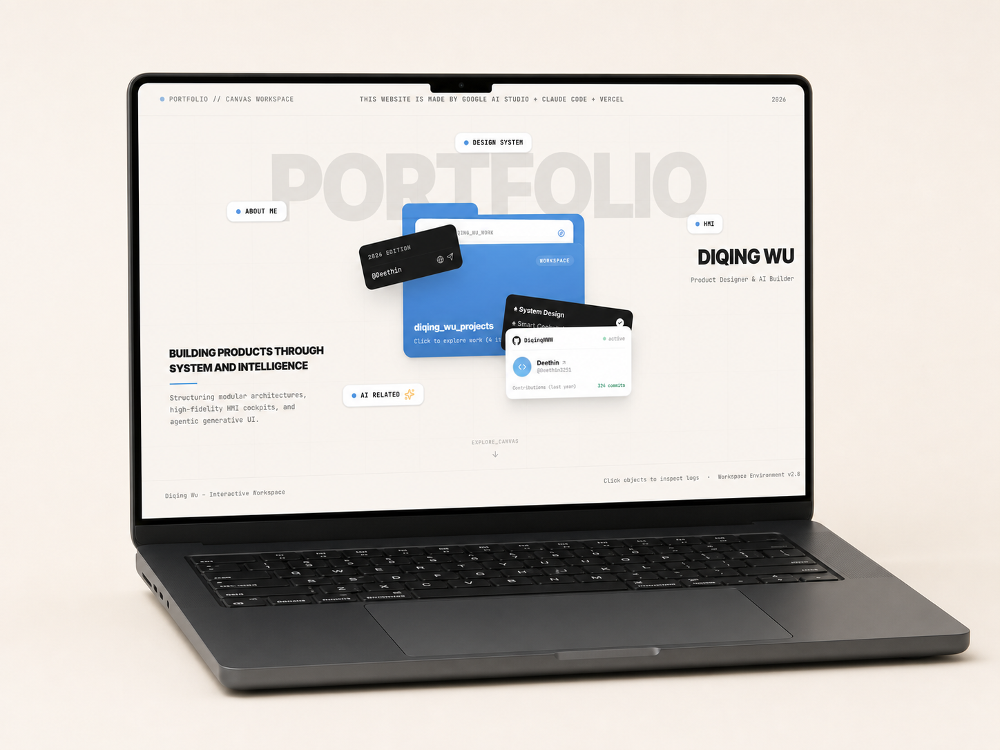
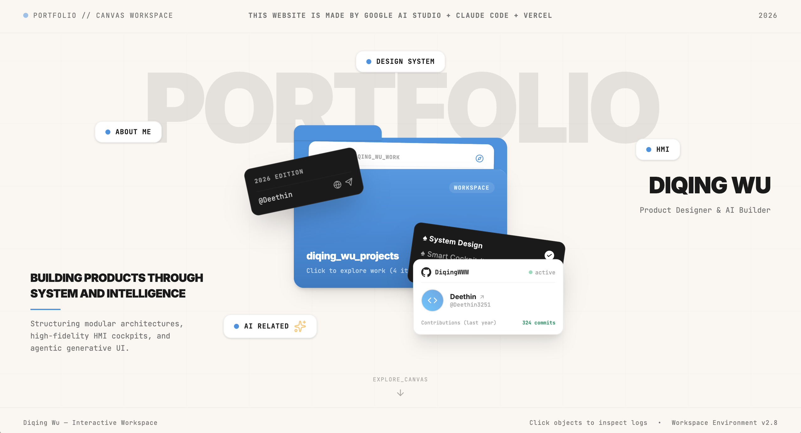

<!-- 中文内容母版。英文 Website 版由本文件提炼并翻译至 website.en.json；首页短叙事位于 project.json。 -->

# 从 AI 生成网站，到建立 Portfolio Operating System

> Building a Portfolio with AI and How It Iterates

**角色：** Product Designer & AI Builder　**周期：** 2026.06–Present　**性质：** 持续迭代的个人项目

我最初只是想借助 AI，以有限预算做出一个具有个人辨识度、又能由自己维护的作品集网站。项目开始于 2026 年 6 月 26 日：使用 Google AI Studio 探索视觉和交互，把确认后的结果交给 Claude Code 工程化，再通过 GitHub 和部署平台发布。DeepSeek API 曾作为成本较低的模型选择，为部分 Claude Code 工作提供能力。

这个计划把 AI 协作理解成一条顺序明确的生产线：一个工具生成页面，另一个工具把它变成网站。但当第一个视觉版本进入本地项目时，我很快发现，真正困难的不是让 AI 生成更多代码，而是让不同工具围绕同一个长期产品工作，同时不在每次交接时丢失视觉意图、工程上下文和已经做出的决定。

今天，这个仓库已经不再只是一张生成页面。它包含一个可运行的空间化作品集、三个真实项目及其独立案例页、Project–Tag 内容关系、项目资产与叙事来源，以及用于保存长期边界、当前实现和迁移状态的治理文档。结果可以概括为三个相互支撑的层次：体验层提供独特的工作区入口和常规项目浏览路径；系统层区分 Project、Tag、Asset、Case Study 和全局内容；方法层让视觉工具、工程工具、GitHub 和部署平台围绕同一份产品状态协作。



**Portfolio reconstruction｜** 这张 mockup 用于呈现当前产品方向，不是独立历史版本，也不是真实设备照片。

## 当最好的视觉工具不是最合适的工程工具

Google AI Studio 能更快地产生接近目标的视觉氛围，Claude Code 则更适合理解文件结构、修改组件和处理工程问题。两种能力都需要，但它们无法自然共享同一份项目上下文。

最初，我考虑过两种交接方式。第一种是反复传递完整代码包，这能保留视觉细节，却可能覆盖本地已经完成的组件修改和工程优化，也会随着版本增加放大比较成本。第二种是把视觉结果重新写成 UI spec；字体、颜色和间距可以被描述，但复杂组件、motion、图片关系和页面氛围会在文字转译中损失。

这让问题从“哪个 AI 最会做网站”变成了：**怎样让擅长视觉和擅长工程的工具同时参与，又不让任何一个工具把已有系统重新解释一遍？**

我的选择不是继续寻找一个包办全部工作的模型，而是改变交接单位。正在运行的 Next.js 项目继续作为当前状态；AI Studio 确认后的代码作为视觉证据和候选输入；工程工具先识别变化、追踪依赖，再只同步需要改变的部分。

这套 diff sync 方法同时保护了两类价值：一类是很难完全翻译成文字的视觉细节，另一类是已经存在于仓库中的组件关系、类型约束、内容引用和部署准备。每次改动不再默认重建整页，而需要先回答变化在哪里、依赖什么、会影响什么，以及如何验证没有破坏已有行为。

工作方式由此从 **Page generation** 转向 **State management between AI tools**。AI 生成结果不再被当作一次性交付物或新的完整真相，而是一个持续产品中的候选变化。

## 一个能运行的页面，仍然可能无法维护

早期落地暴露了更具体的问题：AI Studio 与本地项目中的文件名并不一致，直接替换可能让已有代码失效；本地 HTML 可以显示结果，却很难定位 hover 图片、motion 和具体组件的来源；媒体存在于界面里，却没有稳定的项目归属。

第一次尝试的价值不在于它看起来是否完整，而在于它证明了视觉结果、组件行为、内容和资产之间如果没有可追踪关系，生成页面仍然无法成为长期产品。我开始从浏览器里的实际行为反向定位源码，在真正的组件边界修改 hover 和 motion，把媒体归还给具体项目，并让展示内容通过稳定路径引用。

第一张保留下来的可运行截图记录了这个转折点。空间化工作区、标签入口、中央项目文件夹和个人身份卡片已经出现，说明核心体验方向能够运行；但它仍然属于以视觉原型为中心的阶段，不能用来证明后来形成的内容架构、可访问性或部署可靠性。



**Source evidence｜** 截图中的文字、数字和版本标签只代表当时的界面状态，不作为当前项目事实。

## Tag 不是 Project：从树状页面走向网状内容

首页包含 About Me、HMI、AI Related 和 Design System 等入口。早期生成方案把这些入口理解成文件夹或具体项目，并提供了一棵完全树状的分类。但我希望观众能按照自己的兴趣发现作品，而同一个项目本来就可能同时证明多个能力。例如 Honda Design System 可以同时关联 HMI、Design System 和系统思维。

界面上的入口并不等于底层内容实体。我因此把可复用的 Tag 与独立 Project 分开：

```text
HMI Tag ────────────┐
Design System Tag ──┼── Project
AI Tag ─────────────┘

Mac OS folder ───────── All Projects
```

Project 拥有稳定身份、公开显示名、内容、资产和案例叙事，并可以关联多个 Tag；Tag 负责提供基于兴趣的发现入口；Mac OS folder 则提供不经过标签筛选的完整项目入口。内部目录名、展示名和分类也不再被迫保持相同。

这项内容决策后来直接支持了三个真实项目、多个发现路径和独立案例页，并为未来的中英文内容与历史版本保留了稳定项目身份。网站从一组页面和视觉入口，开始变成内容驱动的系统。

## 当原型进入生产环境，成功标准也发生了变化

从 6 月 28 日开始，项目进入 Next.js、GitHub 和真实部署平台构成的生产环境。本地能够显示，不再等于网站可以发布、维护和继续演进。项目先后遇到 workspace root 判断、多个 lockfile、TypeScript、图标引用、构建与类型检查不一致，以及 Cloudflare OpenNext 兼容等问题。

这些问题不是一串值得展示的 bug 清单。它们共同改变了设计循环：视觉是否被还原、motion 是否正确，必须与代码能否构建、内容能否追踪、平台是否兼容，以及后续修改会不会破坏已有行为一起验证。

GitHub 因此不只是部署前的中转，而成为版本记录、远程基准和 AI 协作中的共同参照。Vercel 已经完成过可运行部署，但中国大陆网络访问不稳定；Cloudflare 经过实际尝试，截至当前仍未成功。这个未完成状态被保留为真实限制，而不是在叙事中被包装成发布成果。

部署和修改次数增加后，版本问题也随之出现：v0、v1、v2 是否需要不同仓库或长期分支？最终形成的策略是把 Portfolio 视为一个 living product。小版本沿主线持续更新，不为每次视觉变化重新建立仓库；只有真正替代现有体验的正式大版本，才值得通过 archive route 或独立入口保留。

V1/V2 目前仍是未来方向，没有可公开的历史站点，因此现阶段不会制造空入口。等到真实大版本被替代时，历史入口应该同时解释它存在的时间、当时的判断和被替代的原因，而不只是提供一个旧页面链接。

## 新工具加入后，我选择保存上下文，而不是重新开始

项目没有形成僵硬的“设计交给 A、开发交给 B”。Google AI Studio 主要承担视觉原型和界面调整；Claude Code 和 Codex 都承担代码理解、差异整合、调试、架构梳理和维护。早期我主要在 VS Code 中使用 Claude Code；后来因为 Codex 的工作区整合更完整，Codex 逐渐成为主要工程协作者，Claude Code 转为辅助。

工具名单可能继续变化，因此真正需要稳定的是职责边界：视觉工具探索和表达设计意图，工程工具把已确认的意图吸收到当前系统中；内容来源、代码差异、Git 历史和验证结果共同维护产品状态。任何新工具进入时，都应该先理解项目目标、当前结构和不可随意改变的决定。

2026 年 7 月底，Codex 的加入没有触发又一次重做，反而推动我把散落在对话和代码里的判断系统化。我开始建立 Portfolio OS、Current System、迁移计划、审计和 AI Working Agreement，分别记录长期产品边界、当前实现、临时变化和协作规则。

至此，作品集形成三个彼此连接的层级：体验层承载空间化工作区、窗口、motion 和常规项目路径；内容层让 Project、Tag、Asset、Case Study 和全局内容承担不同职责；治理层则用 Git 历史、系统文档、迁移计划和验证流程保存决策，使下一位 AI 不必重新开始。

我最初问的是“AI 能不能帮我完成一个作品集”。项目最终提出的问题更接近：**如何让设计师、多个 AI 工具、代码、内容和版本在持续变化时保持连续？** Portfolio Operating System 是目前对这个问题最重要的回答。

## 当前结果与仍然开放的问题

项目已经建立了可运行的网站、内容与资产架构、Project–Tag 关系、增量同步方法、版本策略和 AI 协作治理。它也让我确认：AI 可以加快探索和实施，但连续性不会自动产生。设计师仍然需要定义问题和实体、分配工具职责、判断取舍、验证实现，并把重要决定保存成后续协作者能够理解的形式。

当前可以验证的是系统与发布过程，而不是市场结果。项目仍在进行，因此不声称访问量、招聘转化、任务完成率或性能提升。早期 AI Studio 源码、失败的视觉替换对比和分散的 AI 对话也没有形成完整档案；首次可运行截图、当前仓库、Git 历史和系统文档构成现有证据。

---

## 批准素材清单

以下为 `content/projects/portfolio-operating-system/` 中当前全部批准视觉素材，按叙事出现顺序排列：

| 顺序 | 资产 | 出现位置 | Caption | Truth status |
|---|---|---|---|---|
| 01 | `portfolio-workspace-laptop-mockup-v1.png` | 开篇结果预览之后 | 当前作品集方向的展示 mockup；不是独立历史版本或真实设备照片。 | `Portfolio reconstruction` |
| 02 | `first-working-prototype.png` | “一个能运行的页面，仍然可能无法维护”段落 | 2026 年 6 月首次可运行工作区；画面标签、数字和版本文字只记录当时界面状态。 | `Source evidence` |

## TODO｜待补充信息与证据

- 找到或在不伪造原始证据的前提下重建一次可信的 AI Studio → 工程仓库差异对比。
- 补充某一次完整交接中，哪些视觉或工程上下文实际被覆盖、丢失或需要返工。
- 为 Project–Tag 网状关系制作经过确认的正式架构图。
- 明确 diff sync 在后续迭代中如何记录、比较和验收，避免把方法名称写得比实际流程更成熟。
- 在 Cloudflare 路径解决或决定放弃后，记录最终部署选择、判断依据和限制。
- 补充个人决策与 AI 建议之间更具体的边界案例，例如哪些建议被拒绝、为什么拒绝。
- 当站点开始稳定收集数据后，再定义并记录性能、阅读行为和招聘相关结果。
- 等真正的大版本被替代后，再整理 V1/V2 历史入口所需的版本时间、设计差异和替代原因。
